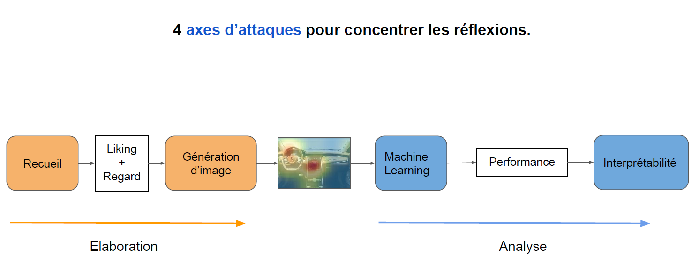

# Home-made Eye tracking, cognitive sciences through machine learning 

The main goal of this project was to democratize the eye-tracking technology. It was made by three master’s degrees students in exploratory statistic and sensometry (science of analyzing consumer response to stimulation) during a two-month period.
The tools needed for this work are a webcam equipped computer, R and GazeRecorder software (GazeRecorder is free and ready-to-use and render the eye-track recordings as a *.txt* file where V1, V2, V3 are x, y, t).

This experiment was made using 16 car’s cockpits as visual stimuli in order to determine consumers products appreciation. The expression of eye scanning is called heatmap, the usual representation relies on duration. The non-conclusiveness of the duration data drew us to further data exploration towards stronger visualization in terms of co-variables illustration. We aimed to visually encode chronology or consumer feedback (or else) into those heatmaps in order to keep input as images. As the data were analyzed throughout machine learning of images (both because it’s the literature type of eye-tracking presentation and machine learning of images are well constructed to deliver determinant area of algorithm decisioning).

Stimuli visualization was always preceded by a calibration phase.

In this *README.md* we are going to go over the repository in order to detail folders’ functionality.

# Overall
The folder “experience” contains every brick we used in the process of data collection and visualization. However, it only contains the raw processing elements. The results of data collection and manipulations are inside the “data” folder. The manipulations algorithm of those bricks that gave the are inside the “script” folder.
You'll also found the support we used for our oral presentation (in french) it's named "presentation_orale_trackers.pdf"

## Experience
2 folders, 3 csv, 1 R Workspace

### R Workspace :
-	Plan_exp : resumed each consumers stimuli presentation order. For each of the stimuli there is a presentation duration (the consumer could either watch it for 60 seconds or cut the visioning when he felt like it).
### csv :
-	25_square_position : each calibration path is color associated, this csv gives all the square position into a 16:9 space.
-	correspondance_stimu_couleur : a csv file of each calibration path associated with a stimulus.
-	calibration_correlation : it is the estimation of how fitted the calibration phase was with physical reality. There are 5 classes : parfait, yes, maybe, complex, no.
### folders :
-	cockpit_utile : each cockpits images named as it’s coding number.
-	AOI : a simplistic illustration of the cockpit where each Area Of Interest (AOI) are color illustrated in order to facilitate zoning for the algorithm. (e.g : each steering wheel are blue).

## script 
4 folders, 1 Requirements.R

### Requirements.R
- All the needed libraries to run the project

### folders
-	0_exploratory_analysis : This folder contains parts of our researching work that were not implemented in the final production script but could have been develop into suitable solution. Some of those script may not be running perfectly but they are not needed in the project functioning.
-	1_data_processing : Those R files are what were used for the data pre-processing. From downloading the GazeRecorder .txt files from google drive to isolating gazing phase and calibration phase data. “helpers_data_process” is a script of functions called into “main_data_process” and “double_looper” which are the main data generation functions of this folder. “double_looper” has a list of heatmap generation and data visualisation possibilities that are directly loaded into the “data” folder (one of the main folders previously presented).
-	2_heatmap : Those scripts are made for the heatmap generations (both real from collected data and false with forced structures in order to test the machine learning algorithm).
-	3_ML_interpretability : Those scripts are both the machine learning and the interpretability analysis. The machine learning was made through CNN from Keras for image recognition. Interpretability used LIME. Both are in the LIME package.

## Data
2 folders, 1 R Workspace, 2 csv

### csv
-	questionnaire : after recording the data we questioned the consumer in order to put into perspective their preferences in terms of car design and their views on driving. Because of the non-conclusivness of the algorithm liking categorization we did not used those variables.
-	time_user_exp: this csv file was the raw collection data as to duration of stimuli presentation and liking labeling from the consumer for each car named by it’s code.

### R Workspace 
-	df_all : it resumes all the needed data from experience planning, to liking to duration to calibration path.

### folders
-	gazedata : the raw data collected through GazeRecorder
-	input_ML : The image section where the algorithm generates the heatmap in order to used them into machine learning.

#
### Scheme

#

# Authors
Project conduct by Antoine LUCAS @antoinelucasfra, Flavie THEVENARD @FlavThvnrd and Julien PETOT @jpetot in the context of a second year master degree in Data Science.

